# 📘 LocalEats — Documentación Técnica del Proyecto

> Aplicación web estilo *Uber Eats* simplificada, construida con una arquitectura de **microservicios**.
> Interfaz de usuario en **español**.
>
> **Versión del documento:** 1.0 · **Fecha:** 22 de julio de 2026 · **Rama:** `second-bimester`

---

## 📑 Tabla de contenidos

1. [Resumen ejecutivo](#1-resumen-ejecutivo)
2. [Stack tecnológico](#2-stack-tecnológico)
3. [Arquitectura general](#3-arquitectura-general)
4. [Equipo y aportes por desarrollador](#4-equipo-y-aportes-por-desarrollador)
5. [Backend — API Gateway y microservicios](#5-backend--api-gateway-y-microservicios)
6. [Modelo de datos](#6-modelo-de-datos)
7. [Frontend — Next.js](#7-frontend--nextjs)
8. [Seguridad y autenticación (JWT)](#8-seguridad-y-autenticación-jwt)
9. [Comunicación en tiempo real (Socket.IO)](#9-comunicación-en-tiempo-real-socketio)
10. [Diagramas de flujo (secuencia)](#10-diagramas-de-flujo-secuencia)
11. [Monitoreo (Prometheus + Grafana)](#11-monitoreo-prometheus--grafana)
12. [Convenciones de documentación de código](#12-convenciones-de-documentación-de-código)
13. [Catálogo de endpoints del Gateway](#13-catálogo-de-endpoints-del-gateway)
14. [Anexos](#14-anexos)

---

## 1. Resumen ejecutivo

**LocalEats** es una plataforma de pedidos de comida que permite a los usuarios registrarse, iniciar sesión, explorar y administrar productos, realizar pedidos, chatear con soporte en tiempo real y recibir notificaciones. Cuenta además con un panel de administración de usuarios.

El sistema evolucionó desde un **monolito Next.js** (donde las rutas `/api/*` locales resolvían todo con Prisma) hacia una **arquitectura de microservicios** con **NestJS**, donde:

- Un **API Gateway** (única puerta HTTP) expone la API REST y valida la seguridad.
- Tres **microservicios** independientes (Auth, Product, Support), cada uno con su **propia base de datos**.
- El **frontend** consume exclusivamente el Gateway a través de un proxy `/gw`, enviando un **JWT** en cada petición protegida.

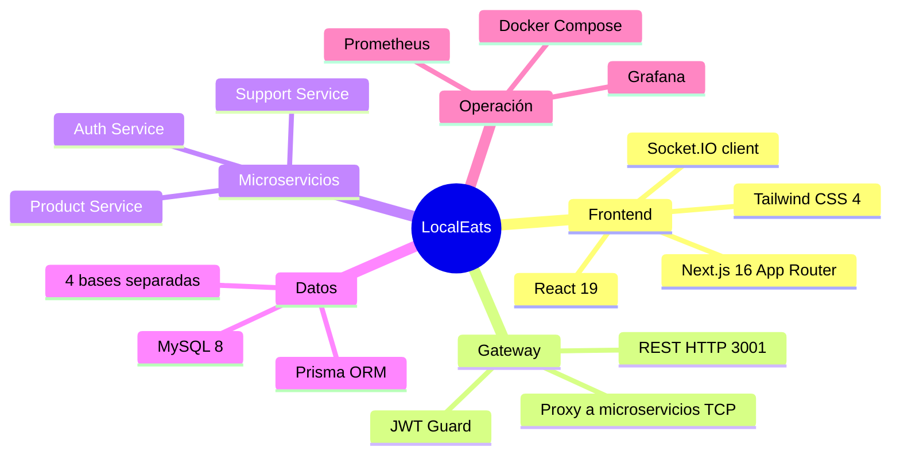

---

## 2. Stack tecnológico

| Capa                     | Tecnología               | Versión | Rol                                 |
| ------------------------ | ------------------------- | -------- | ----------------------------------- |
| **Frontend**       | Next.js (App Router)      | 16.2.6   | SSR + páginas cliente              |
|                          | React                     | 19.2.4   | UI                                  |
|                          | Tailwind CSS              | 4        | Estilos                             |
|                          | Framer Motion             | 12       | Animaciones                         |
|                          | Recharts                  | 3        | Gráficas del dashboard             |
|                          | Socket.IO client          | 4.8      | Chat/notificaciones en vivo         |
| **Servidor web**   | Node HTTP +`server.js`  | Node 20  | Servidor custom (Next + Socket.IO)  |
| **Backend**        | NestJS                    | 11       | Gateway + microservicios (monorepo) |
|                          | `@nestjs/microservices` | 11       | Transporte TCP entre servicios      |
|                          | `@nestjs/jwt`           | 11       | Firma/verificación de JWT          |
|                          | bcrypt                    | 6        | Hash de contraseñas                |
| **ORM / BD**       | Prisma                    | 5.22     | ORM                                 |
|                          | MySQL                     | 8.0      | Base de datos (4 esquemas)          |
| **Observabilidad** | Prometheus                | latest   | Métricas                           |
|                          | Grafana                   | latest   | Dashboards                          |
| **Orquestación**  | Docker Compose            | v2       | Levantar todo el stack              |

---

## 3. Arquitectura general

### 3.1 Vista de contenedores

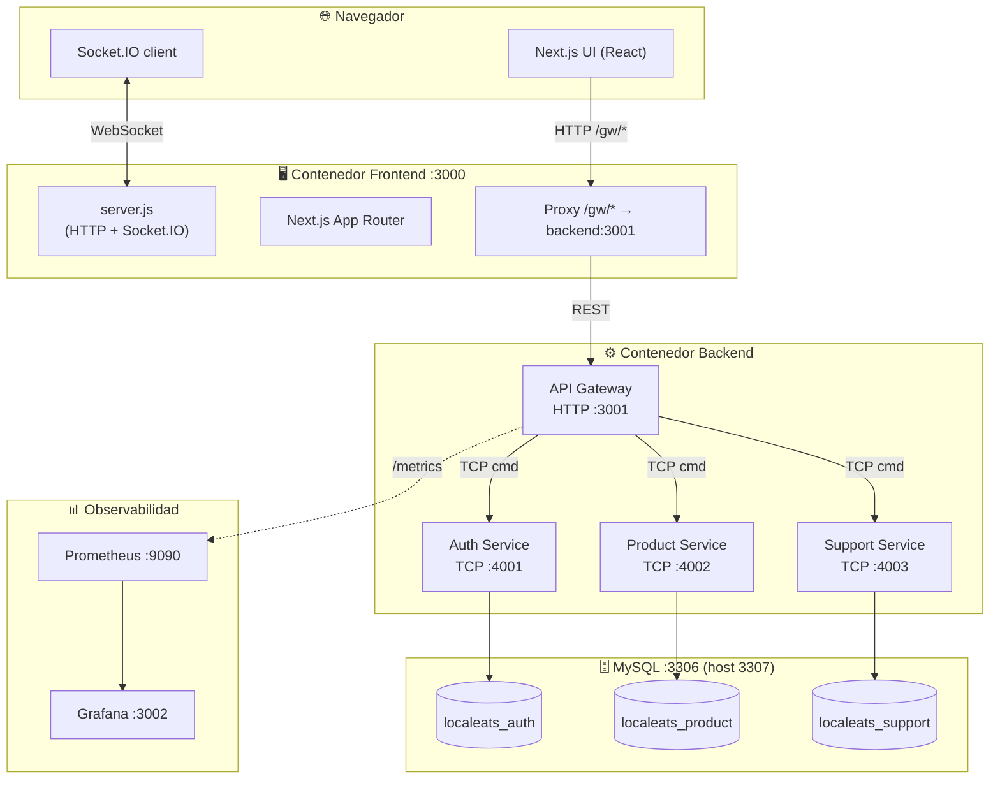

### 3.2 Principios de diseño

- **Única puerta de entrada:** el navegador jamás habla directamente con un microservicio. Todo pasa por el Gateway (`:3001`), y desde el navegador por el proxy `/gw` (evita CORS y centraliza la URL).
- **Base de datos por servicio:** cada microservicio es dueño de su esquema. No comparten tablas; se comunican por mensajes.
- **Transporte TCP interno:** Gateway ↔ microservicios usan mensajería `@nestjs/microservices` (patrón `{ cmd: '...' }`).
- **Seguridad en el borde:** el `JwtAuthGuard` del Gateway valida el token *antes* de reenviar al microservicio.
- **Frontend agnóstico:** un único cliente HTTP (`app/lib/api.js`) encapsula el prefijo `/gw`, el JWT y el manejo de errores/401.

### 3.3 ¿Por qué "un contenedor" para el backend?

El monorepo NestJS arranca los 4 procesos dentro del **mismo contenedor** comunicándose por `127.0.0.1` (loopback). El `docker-entrypoint.sh` aplica migraciones y lanza los 3 microservicios en segundo plano + el Gateway en primer plano. Solo se expone el puerto **3001**.

---

## 4. Equipo y aportes por desarrollador

Atribución obtenida del historial de Git (`git shortlog`). Cinco desarrolladores colaboraron:

| Desarrollador                              | Commits | Área principal                                          |
| ------------------------------------------ | :-----: | -------------------------------------------------------- |
| **Edison Quishpe**                   |   39   | Backend NestJS, microservicios, APIs iniciales           |
| **Daniel Alejandro Oña Rosado**     |   24   | Frontend base (páginas, formularios, chat)              |
| **Sebastián Correa** (`SebasC02`) |   15   | Seguridad, monitoreo, asociación de datos               |
| **Maximiliano Madrid**               |   13   | UI/UX, panel admin, notificaciones, migración a Gateway |
| **R0AD28**                           |    5    | DevOps: Docker, CI/CD, configuración                    |

### 4.1 Edison Quishpe — *Arquitecto backend*

- Inicialización del proyecto Next.js y del **monorepo NestJS** (API Gateway).
- **Auth Service:** registro, login con bcrypt, emisión y validación de **JWT**.
- **Product Service** y **Support Service:** conexión a sus bases de datos, CRUD de productos.
- Configuración del **transporte TCP** entre Gateway y microservicios.
- APIs de **conversaciones y mensajes** del chat de soporte; persistencia del chat.
- Configuración del puerto del Gateway y **CORS** hacia el frontend.

### 4.2 Daniel Alejandro Oña Rosado — *Frontend base*

- Estructura y formularios de **Registro, Login y Forgot-Password** (estado, `handleChange`, conexión a API).
- Página de **Productos**: layout, listado, formulario de creación/edición, botón eliminar, estado de carga.
- Página de **Chat** con Socket.IO: conexión al montar, envío de mensajes, indicador de conexión, auto-scroll, limpieza al desmontar.

### 4.3 Sebastián Correa (`SebasC02`) — *Seguridad y monitoreo*

- Integración del **`JwtAuthGuard`** y `JwtPayload` en el Gateway.
- **Protección de rutas** y **validación/sanitización** de entradas de usuario.
- **Asociación de productos** al usuario que los crea (`ownerId`) y **guardado del `userId` real** en los mensajes del chat.
- **Monitoreo:** integración de **Prometheus + Grafana** y dashboards.

### 4.4 Maximiliano Madrid — *UI/UX y migración a microservicios*

- **Overhaul completo de UI/UX**, panel de **administración**, **notificaciones** y generación de **imágenes con IA**.
- **Migración integral del frontend** para consumir el API Gateway con **JWT** (todos los módulos: Login, Registro, Productos, Carrito/Pedidos, Chat, Perfil, Admin, Notificaciones).
- Nuevos **endpoints backend**: Orders, Users y Notifications.
- **Fix de Docker** para el proxy `/gw` (build-arg `GATEWAY_URL`).

### 4.5 R0AD28 — *DevOps*

- **Dockerfiles** de frontend y backend + **docker-compose** con MySQL.
- **Workflow CI/CD** (linting de frontend y backend).
- Archivo **`.env.example`** y ajustes de configuración (ESLint/tsconfig).

```mermaid
gantt
    title Línea de tiempo lógica del proyecto
    dateFormat X
    axisFormat %s
    section Monolito Next.js
    Auth + Dashboard (Edison)          :0, 2
    Productos + Chat (Daniel/Edison)   :1, 3
    section Seguridad y datos
    Guard JWT + validación (Sebastián) :2, 4
    section Microservicios
    Gateway + 3 servicios (Edison)     :3, 6
    section UI + Migración
    UI/UX + Admin (Maximiliano)        :4, 7
    Migración a Gateway (Maximiliano)  :6, 8
    section DevOps
    Docker + CI/CD (R0AD28)            :5, 8
    Monitoreo (Sebastián)              :6, 8
```

---

## 5. Backend — API Gateway y microservicios

### 5.1 Estructura del monorepo

```
backend/api-gateway/
├── apps/
│   ├── api-gateway/         # HTTP :3001 — única puerta expuesta
│   │   └── src/
│   │       ├── app.controller.ts   # Todas las rutas REST
│   │       ├── app.module.ts       # Registra clientes TCP + Prometheus
│   │       ├── main.ts             # Bootstrap HTTP + CORS
│   │       └── auth/
│   │           ├── jwt-auth.guard.ts   # Valida Bearer contra Auth Service
│   │           └── jwt-payload.type.ts
│   ├── auth-service/        # TCP :4001 — usuarios y JWT
│   ├── product-service/     # TCP :4002 — productos y pedidos
│   └── support-service/     # TCP :4003 — chat y notificaciones
├── docker-entrypoint.sh     # Migra + arranca los 4 procesos
└── Dockerfile
```

### 5.2 Diagrama de clases/componentes del backend

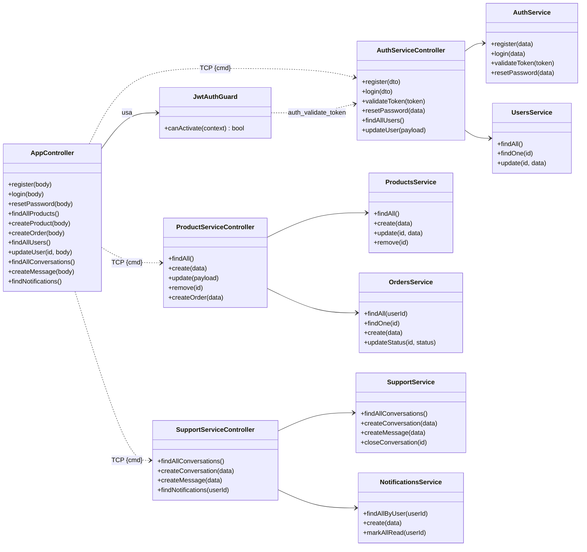

### 5.3 Patrón de comunicación TCP

El Gateway **no** contiene lógica de negocio: traduce HTTP → mensaje TCP y reenvía.

```typescript
// Gateway (app.controller.ts)
@Post('products')
@UseGuards(JwtAuthGuard)
createProduct(@Body() body) {
  return this.productClient.send({ cmd: 'products_create' }, body);
}
```

```typescript
// Microservicio (product-service.controller.ts)
@MessagePattern({ cmd: 'products_create' })
create(@Payload() data) {
  return this.productsService.create(data);   // lógica real
}
```

| Concepto      | Gateway (emisor)                     | Microservicio (receptor)                        |
| ------------- | ------------------------------------ | ----------------------------------------------- |
| Identificador | `{ cmd: 'products_create' }`       | `@MessagePattern({ cmd: 'products_create' })` |
| Datos         | `.send(pattern, payload)`          | `@Payload() data`                             |
| Respuesta     | `Observable` (se serializa a JSON) | valor retornado                                 |

### 5.4 Lógica de negocio destacada — cálculo de pedidos

El `OrdersService` **no confía en el precio enviado por el cliente**: recalcula el total con los precios reales de la base de datos (previene manipulación de precios).

```typescript
// orders.service.ts — extracto
const products = await this.prisma.product.findMany({
  where: { id: { in: productIds } },
});
let totalAmount = 0;
const itemsData = data.items.map((item) => {
  const product = products.find((p) => p.id === Number(item.productId));
  if (!product) throw new NotFoundException(`Producto ${item.productId} no encontrado`);
  const priceAtPurchase = Number(product.price);   // precio real de la BD
  totalAmount += priceAtPurchase * item.quantity;
  return { productId: Number(item.productId), quantity: item.quantity, priceAtPurchase };
});
```

---

## 6. Modelo de datos

Cada microservicio posee su **propia base de datos MySQL**. No hay claves foráneas entre servicios: las relaciones "cross-service" (p. ej. un pedido pertenece a un usuario) se guardan solo como `userId` (un entero), sin `JOIN`.

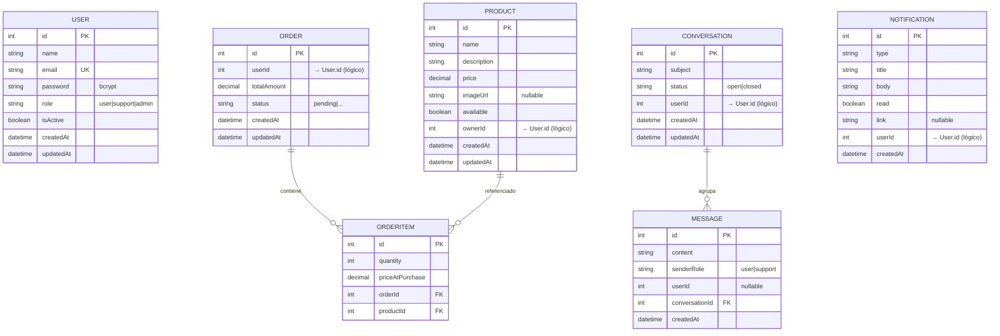

> **Nota de arquitectura:** las líneas de relación solo existen *dentro* de un mismo servicio. Entre `USER` (Auth) ↔ `PRODUCT`/`ORDER` (Product) ↔ `CONVERSATION` (Support) la relación es **lógica** (por `userId`/`ownerId`), no una FK física. Esto es intencional en microservicios.

### 6.1 Distribución de tablas por base

| Base de datos         | Servicio                           | Tablas                                          |
| --------------------- | ---------------------------------- | ----------------------------------------------- |
| `localeats_auth`    | Auth                               | `User`                                        |
| `localeats_product` | Product                            | `Product`, `Order`, `OrderItem`           |
| `localeats_support` | Support                            | `Conversation`, `Message`, `Notification` |
| `localeats`         | (Frontend, legado, sin uso activo) | —                                              |

---

## 7. Frontend — Next.js

### 7.1 Estructura de carpetas

```
app/
├── layout.tsx              # Layout raíz (TypeScript) → envuelve AuthProvider/ThemeProvider
├── page.tsx                # Homepage
├── globals.css             # Estilos Tailwind
├── lib/
│   └── api.js              # ⭐ Cliente HTTP centralizado (proxy /gw + JWT)
├── components/
│   ├── AuthProvider.js     # Contexto de sesión + ProtectedRoute
│   ├── ThemeProvider.js    # Tema e i18n (t())
│   ├── Navbar.js           # Navegación
│   └── NotificationPanel.js# Campana + Socket.IO
├── login/        page.js   # Inicio de sesión
├── register/     page.js   # Registro
├── forgot-password/ page.js# Reseteo de contraseña
├── dashboard/    page.js   # Panel con métricas (Recharts)
├── products/     page.js   # CRUD de productos + carrito/pedido
├── orders/       page.js   # Historial de pedidos
├── chat/         page.js   # Chat de soporte (usuario)
├── support/      page.js   # Lista de tickets
│              [id]/page.js # Detalle de conversación
├── admin/        page.js   # Administración de usuarios
└── api/
    └── generate-image/     # (Único endpoint local que se conserva: imágenes IA)
```

### 7.2 Diagrama de componentes del frontend

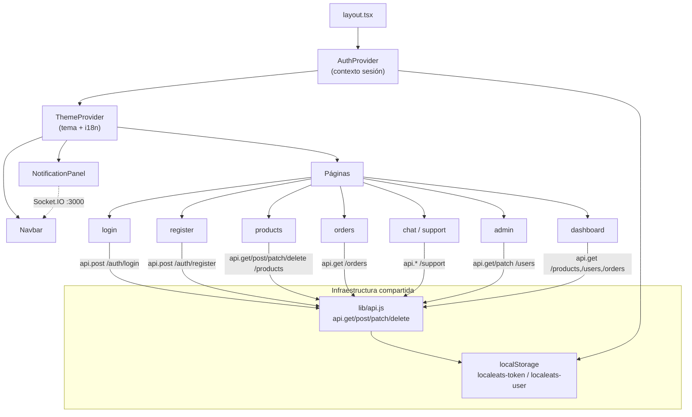

### 7.3 Cliente HTTP central — `app/lib/api.js`

Toda la comunicación pasa por aquí. Responsabilidades:

1. **Prefijo `/gw`** → el proxy de Next.js reenvía a `backend:3001`.
2. **Serialización JSON** automática del `body`.
3. **Adjuntar el JWT** (`Authorization: Bearer <token>`) salvo `{ auth: false }`.
4. **Manejo de 401**: limpia token + usuario y redirige a `/login`.
5. **Errores del backend** propagados como `Error(message)`.

```javascript
export const api = {
  get:    (path, options)       => apiFetch(path, { ...options, method: "GET" }),
  post:   (path, body, options) => apiFetch(path, { ...options, method: "POST",   body }),
  patch:  (path, body, options) => apiFetch(path, { ...options, method: "PATCH",  body }),
  put:    (path, body, options) => apiFetch(path, { ...options, method: "PUT",    body }),
  delete: (path, options)       => apiFetch(path, { ...options, method: "DELETE" }),
};
```

### 7.4 Gestión de sesión — `AuthProvider.js`

- Guarda `user` en `localStorage` (`localeats-user`) y el token vía `setToken()` (`localeats-token`).
- `login({ user, accessToken })` — compatible con el formato del Gateway.
- `logout()` — limpia ambos.
- `ProtectedRoute` — redirige a `/login` si no hay sesión.

### 7.5 Proxy `/gw` — `next.config.ts`

```typescript
const GATEWAY_URL = process.env.GATEWAY_URL || "http://localhost:3001";
async rewrites() {
  return [{ source: "/gw/:path*", destination: `${GATEWAY_URL}/:path*` }];
}
```

> ⚠️ **Importante:** Next.js evalúa `rewrites()` en tiempo de *build* y hornea el destino en `routes-manifest.json`. Por eso en Docker `GATEWAY_URL` se pasa como **build-arg** (`http://backend:3001`), no solo como variable de runtime.

---

## 8. Seguridad y autenticación (JWT)

### 8.1 Flujo del token

- El **login** (Auth Service) firma un JWT con payload `{ sub: userId, email, role }`, expiración **1h**, usando `JWT_SECRET`.
- El frontend guarda el token y lo envía en cada petición protegida.
- El **`JwtAuthGuard`** del Gateway extrae el `Bearer`, y **delega la validación al Auth Service** (`auth_validate_token`), que además comprueba que el usuario siga **activo**.

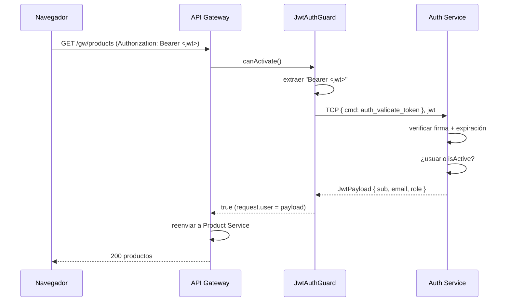

### 8.2 Medidas de seguridad implementadas

| Medida                          | Dónde                        | Detalle                                |
| ------------------------------- | ----------------------------- | -------------------------------------- |
| Hash de contraseñas            | Auth Service                  | `bcrypt` (salt rounds 10)            |
| JWT firmado                     | Auth Service                  | `@nestjs/jwt`, expira en 1h          |
| Validación centralizada        | Gateway`JwtAuthGuard`       | Rechaza 401 antes de tocar la lógica  |
| Verificación de usuario activo | Auth Service`validateToken` | Un usuario desactivado deja de validar |
| Rutas protegidas (frontend)     | `ProtectedRoute`            | Redirige a`/login`                   |
| Manejo de 401 (frontend)        | `lib/api.js`                | Cierra sesión automáticamente        |
| Precios recalculados            | Orders Service                | Evita manipulación de precios         |
| CORS restringido                | Gateway`main.ts`            | Solo`http://localhost:3000`          |
| Validación/sanitización       | Rutas (Sebastián)            | `class-validator` en DTOs            |

> **Nota honesta para la presentación:** el endpoint *forgot-password* resetea la contraseña **sin verificación por correo** (comportamiento heredado). Es un punto de mejora conocido.

---

## 9. Comunicación en tiempo real (Socket.IO)

`server.js` crea un servidor HTTP custom que envuelve Next.js y adjunta **Socket.IO** en el **mismo puerto 3000**. No usa Prisma: solo **retransmite** eventos.

| Evento                | Emisor                                 | Efecto                                                        |
| --------------------- | -------------------------------------- | ------------------------------------------------------------- |
| `register-user`     | Cliente al conectar                    | Asocia`userId` ↔ socket (para notificaciones dirigidas)    |
| `join-conversation` | Cliente del chat                       | Une el socket a la sala`conversation-{id}`                  |
| `support-message`   | Cliente tras`POST /support/messages` | Reenvía el mensaje a la sala`conversation-{id}`            |
| `send-notification` | Cliente/servidor                       | Empuja`new-notification` a los sockets del usuario objetivo |
| `disconnect`        | Automático                            | Limpia el mapa`userId → sockets`                           |

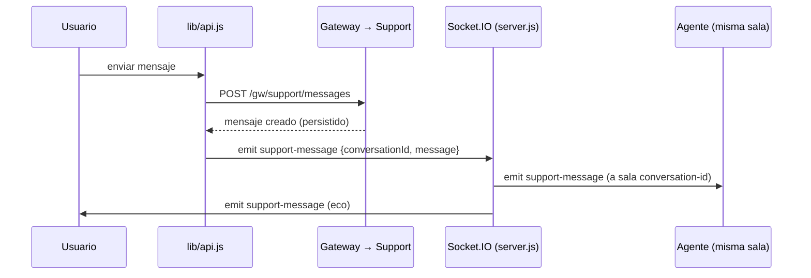

> El mensaje **primero se persiste** vía Gateway (fuente de verdad) y **luego** se retransmite por Socket.IO para la experiencia en vivo.

---

## 10. Diagramas de flujo (secuencia)

### 10.1 Registro de usuario

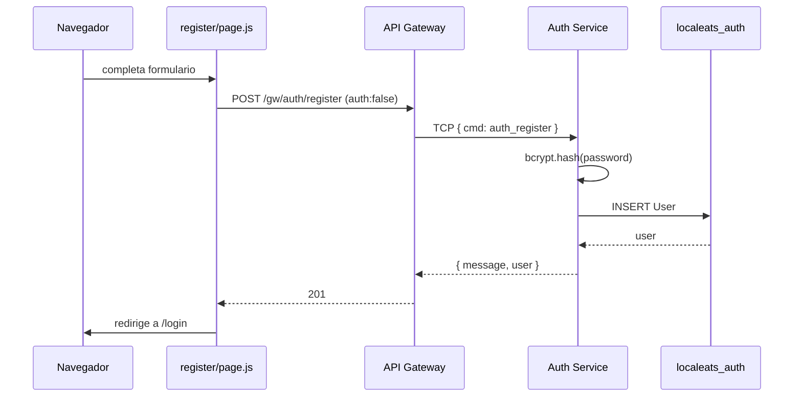

### 10.2 Login (obtención de JWT)

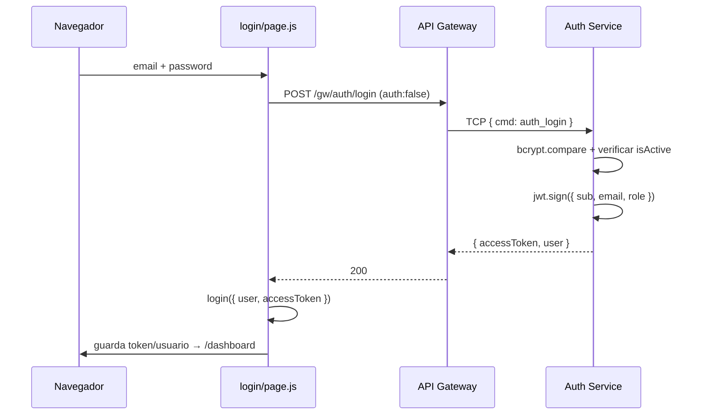

### 10.3 Crear producto (ruta protegida)

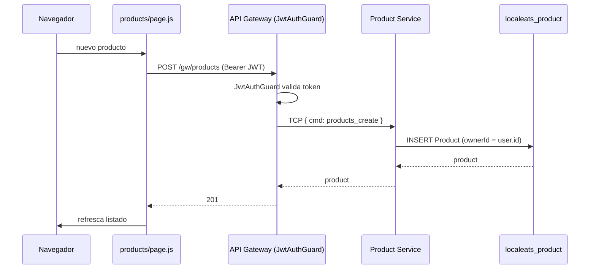

### 10.4 Realizar un pedido

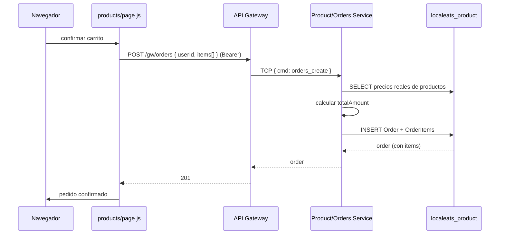

---

## 11. Monitoreo (Prometheus + Grafana)

- El Gateway expone métricas en **`/metrics`** vía `@willsoto/nestjs-prometheus`.
- **Prometheus** (`:9090`) las recolecta según `prometheus.yml`.
- **Grafana** (`:3002`, admin/admin) las visualiza con dashboards provisionados.

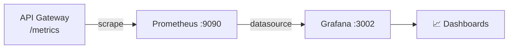

---

## 12. Convenciones de documentación de código

El proyecto documenta el código con un estilo pragmático y consistente:

### 12.1 Comentarios de encabezado (banner)

Archivos clave abren con un bloque que explica su propósito:

```javascript
// =============================================================
//  Cliente HTTP centralizado para consumir el API Gateway
//  - Prefija todas las rutas con /gw (proxy de Next.js -> :3001)
//  - Adjunta el JWT (Authorization: Bearer) automaticamente
//  - Maneja respuestas 401 (token invalido/expirado)
// =============================================================
```

### 12.2 JSDoc en funciones públicas (frontend)

```javascript
/**
 * Realiza una peticion al API Gateway.
 * @param {string} path  Ruta del gateway (ej: "/products", "/auth/login")
 * @param {object} options  Opciones fetch (method, body, headers, auth)
 * @returns {Promise<any>}  JSON parseado
 */
export async function apiFetch(path, options = {}) { ... }
```

### 12.3 Decoradores autodocumentados (backend NestJS)

Los decoradores describen la intención sin comentarios adicionales:

```typescript
@Post('orders')
@UseGuards(JwtAuthGuard)          // ← requiere autenticación
createOrder(@Body() body) { ... } // ← recibe el cuerpo JSON
```

```typescript
@MessagePattern({ cmd: 'orders_create' })  // ← handler TCP
createOrder(@Payload() data) { ... }        // ← payload del mensaje
```

### 12.4 Tipado como documentación (TypeScript)

Los `type`/interfaces del backend documentan la forma de los datos:

```typescript
// jwt-payload.type.ts
export interface JwtPayload {
  sub: number;    // id del usuario
  email: string;
  role: string;   // "user" | "support" | "admin"
}
```

### 12.5 Convención de commits

Se sigue **Conventional Commits** en español:

```
feat(frontend): migrar Products y Orders al API Gateway
fix(docker): proxy /gw del frontend apunta al backend
chore(frontend): eliminar rutas API Next.js obsoletas
```

| Prefijo   | Uso                    |
| --------- | ---------------------- |
| `feat`  | Nueva funcionalidad    |
| `fix`   | Corrección de errores |
| `chore` | Mantenimiento/limpieza |

### 12.6 Recomendaciones de mejora (a futuro)

- Añadir **Swagger/OpenAPI** (`@nestjs/swagger`) al Gateway para documentación de API navegable.
- Documentar DTOs con `class-validator` + descripciones.
- Añadir pruebas automatizadas (actualmente no hay framework de tests configurado).

---

## 13. Catálogo de endpoints del Gateway

Base pública desde el navegador: **`/gw`** (proxy) → **`http://localhost:3001`** (directo).
🔒 = requiere JWT (`Authorization: Bearer`).

### Autenticación

| Método  | Ruta                      | Auth | Descripción                  |
| -------- | ------------------------- | :--: | ----------------------------- |
| `GET`  | `/auth/health`          |  —  | Salud del Auth Service        |
| `POST` | `/auth/register`        |  —  | Registrar usuario             |
| `POST` | `/auth/login`           |  —  | Iniciar sesión → JWT        |
| `POST` | `/auth/forgot-password` |  —  | Resetear contraseña          |
| `GET`  | `/auth/profile`         |  🔒  | Devuelve el payload del token |

### Productos y pedidos

| Método    | Ruta                   | Auth | Descripción                          |
| ---------- | ---------------------- | :--: | ------------------------------------- |
| `GET`    | `/products`          |  🔒  | Listar productos                      |
| `GET`    | `/products/:id`      |  🔒  | Obtener producto                      |
| `POST`   | `/products`          |  🔒  | Crear producto                        |
| `PATCH`  | `/products/:id`      |  🔒  | Actualizar producto                   |
| `DELETE` | `/products/:id`      |  🔒  | Eliminar producto                     |
| `GET`    | `/orders?userId=`    |  🔒  | Listar pedidos (opcional por usuario) |
| `GET`    | `/orders/:id`        |  🔒  | Obtener pedido                        |
| `POST`   | `/orders`            |  🔒  | Crear pedido                          |
| `PATCH`  | `/orders/:id/status` |  🔒  | Cambiar estado del pedido             |

### Usuarios (administración)

| Método   | Ruta           | Auth | Descripción                     |
| --------- | -------------- | :--: | -------------------------------- |
| `GET`   | `/users`     |  🔒  | Listar usuarios                  |
| `PATCH` | `/users/:id` |  🔒  | Cambiar rol / activar-desactivar |

### Soporte y notificaciones

| Método   | Ruta                                 | Auth | Descripción               |
| --------- | ------------------------------------ | :--: | -------------------------- |
| `GET`   | `/support/conversations`           |  🔒  | Listar conversaciones      |
| `GET`   | `/support/conversations/:id`       |  🔒  | Conversación + mensajes   |
| `POST`  | `/support/conversations`           |  🔒  | Crear ticket               |
| `POST`  | `/support/messages`                |  🔒  | Enviar mensaje             |
| `PATCH` | `/support/conversations/:id/close` |  🔒  | Cerrar ticket              |
| `GET`   | `/notifications?userId=`           |  🔒  | Notificaciones del usuario |
| `POST`  | `/notifications`                   |  🔒  | Crear notificación        |
| `PATCH` | `/notifications`                   |  🔒  | Marcar como leídas        |

### Observabilidad

| Método | Ruta         | Descripción         |
| ------- | ------------ | -------------------- |
| `GET` | `/metrics` | Métricas Prometheus |

---

## 14. Anexos

### 14.1 Puertos utilizados

|       Puerto       | Servicio                                |
| :----------------: | --------------------------------------- |
|        3000        | Frontend (Next.js + Socket.IO)          |
|        3001        | API Gateway (HTTP)                      |
| 4001 / 4002 / 4003 | Auth / Product / Support (TCP, interno) |
|    3307 → 3306    | MySQL (host → contenedor)              |
|        9090        | Prometheus                              |
|    3002 → 3000    | Grafana                                 |

### 14.2 Variables de entorno

| Variable                 | Uso                                            |
| ------------------------ | ---------------------------------------------- |
| `DATABASE_URL`         | BD del frontend (legado)                       |
| `AUTH_DATABASE_URL`    | BD del Auth Service                            |
| `PRODUCT_DATABASE_URL` | BD del Product Service                         |
| `SUPPORT_DATABASE_URL` | BD del Support Service                         |
| `JWT_SECRET`           | Secreto para firmar/verificar JWT              |
| `GATEWAY_URL`          | Destino del proxy`/gw` (build-arg en Docker) |

### 14.3 Glosario

| Término                 | Significado                                                       |
| ------------------------ | ----------------------------------------------------------------- |
| **Gateway**        | Punto único de entrada HTTP que enruta a los microservicios      |
| **MessagePattern** | Handler de un mensaje TCP en NestJS (`{ cmd: '...' }`)          |
| **JwtAuthGuard**   | Middleware que valida el token antes de ejecutar la ruta          |
| **ProtectedRoute** | Componente React que exige sesión activa                         |
| **Proxy `/gw`**  | Rewrite de Next.js que evita CORS y centraliza la URL del backend |

---

> 📄 Para instrucciones de arranque paso a paso, consulta **[COMO-LEVANTAR.md](./COMO-LEVANTAR.md)**.
